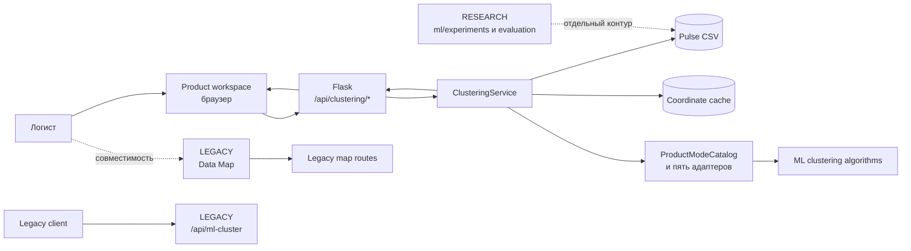
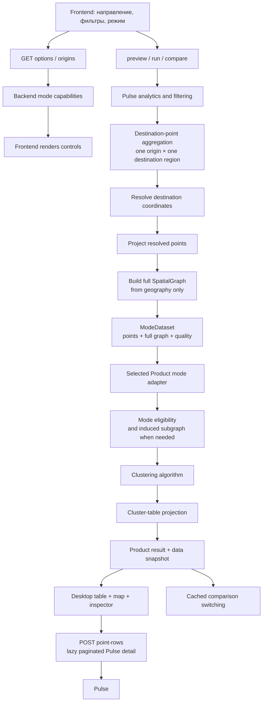

# ИИ Логистика — текущая архитектура

> **Статус: CURRENT.** Этот документ описывает только то, что реализовано сейчас. Продуктовые значения и будущий объём принадлежат [CONTEXT.md](../../CONTEXT.md); обзор для обсуждений — [Project Brief](../project/project-brief.md).

## Система

ИИ Логистика — локальное Flask-приложение с браузерным интерфейсом. Текущий Product позволяет выбрать одно направление и срез данных Pulse, запустить один из пяти режимов кластерного анализа и изучить точки, кластеры, показатели качества данных и нейтральное сравнение режимов. Для Geography, Geo+Cost и Geo+Volume результат также включает desktop-таблицу кластеров и ленивую детализацию точки назначения до строк Pulse.

Product использует алгоритмы из `ml/clustering`, но не зависит от исследовательских runner-ов и отчётов. Наличие эксперимента в `ml/experiments` не делает его продуктовой функцией. Data Map и `/api/ml-cluster` сохранены как отдельные совместимые поверхности; канонический Product вызывает `/api/clustering/*`.

## Product runtime flow

1. Frontend получает направления, фильтры и машинно-читаемые возможности режимов через Product API. Эти данные определяют доступные контролы и значения; интерфейс не содержит второго независимого каталога возможностей.
2. Запрос фиксирует один `origin_fias`, один регион назначения и выбранные типы периода, цены, транспорта и тоннажа. `ClusteringService` фильтрует и агрегирует соответствующие строки Pulse по точкам назначения.
3. Сервис сопоставляет агрегированные точки с локальным кэшем координат. Неразрешённые точки остаются в отчёте качества данных, но не передаются пространственному алгоритму.
4. Разрешённые координаты проецируются, после чего сервис строит полный `SpatialGraph` только из пространственных данных. Экономика не создаёт рёбра.
5. Сервис формирует общий `ModeDataset`: точки с доступными признаками, полный граф и сведения о качестве. Выбранный адаптер нормализует параметры, определяет допустимые точки, выбирает полный или индуцированный граф и вызывает алгоритм своего режима.
6. `ClusteringService` проецирует принадлежность точек к фактическим кластерам того же запуска в рассчитанную backend таблицу, не выполняя отдельную кластеризацию. Для Geography, Geo+Cost и Geo+Volume ответ содержит `cluster_table`; Bear Cost и Bear Volume сохраняют прежнее поведение и возвращают `{"supported": false}`.
7. Сервис возвращает Product-результат вместе с `data_snapshot`. Frontend отображает один снимок на desktop-таблице, карте и в inspector. Для выбранной точки он лениво запрашивает страницы строк Pulse через `POST /api/clustering/point-rows`, повторяя замороженные фильтры и снимок; backend проверяет их согласованность перед выдачей данных.

`preview` проходит тот же каталог и правила выбора режима, но не строит граф и не запускает кластеризацию. `compare` берёт фиксированные сравниваемые конфигурации из каталога и выполняет их на одном срезе данных. Полученные варианты и их таблицы сохраняются frontend; переключение режима сравнения использует этот кэш без пересчёта. Backend-результаты, локации и графы также кэшируются в памяти и сбрасываются при изменении исходного файла или кэша координат.

## Владение режимами

`ProductModeCatalog` — упорядоченный реестр ровно пяти Product-режимов. Он проверяет полноту регистрации, публикует capabilities, направляет выбор и выполнение в нужный адаптер. Каталог не реализует смысл конкретного режима.

Каждый адаптер владеет своим внешним продуктовым поведением:

- нормализацией и проверкой параметров;
- семантическими измерениями и видом результата;
- правилами допустимости точек;
- переводом общего `ModeDataset` в параметры алгоритма;
- продуктовыми статусами точек, предупреждениями и состоянием `no_bears`.

`ClusteringService` остаётся нейтральным к конкретным режимам. Он владеет общей инфраструктурой: областью запроса, доступом к Pulse, агрегацией, координатами, проекцией, полным графом, кэшами, качеством данных, наблюдаемостью, `data_snapshot`, расчётом общей кластерной таблицы и общей JSON-формой результата.

Подробные параметры и публичное поведение находятся в [Product v1 contract](../clustering_product_v1_contract.md), а не дублируются здесь.

## Граница графа и допустимости

Главный пространственный инвариант: полный граф строится до бизнес-фильтрации. Это сохраняет единую географическую основу и не позволяет стоимости или объёму создавать соседство.

- Geography получает все точки с координатами, удаляет экономические признаки из алгоритмического ввода и использует полный граф.
- Geo+Volume использует все пространственные точки и полный граф; объём влияет на объединение внутри допустимой пространственной связности.
- Geo+Cost сначала выбирает точки с валидной экономикой, затем берёт их индуцированный подграф полного графа.
- Bear Cost выбирает точки с положительным объёмом и валидным ₽/км, затем использует индуцированный подграф.
- Bear Volume выбирает точки с положительным объёмом, затем использует индуцированный подграф.

Индуцированный подграф может только удалить точки и рёбра полного графа. Поэтому бизнес-признак меняет допустимость и результат, но не создаёт новую пространственную связь.

## Backend и frontend

Backend владеет машинными возможностями и расчётами: составом и порядком режимов, параметрами, допустимыми значениями, пресетами, типом результата, поддержкой сравнения, показателями кластерной таблицы и проверкой согласованности детализации. `/api/clustering/options` публикует manifest режимов вместе с доступными значениями фильтров.

Frontend владеет представлением: подписями, компоновкой, состояниями формы и результата, stale-state, сортировкой и отображением рассчитанной таблицы, взаимодействием таблицы, карты и inspector, ленивой загрузкой страниц детализации, а также нейтральными карточками сравнения. Он строит контролы из backend capabilities, но backend не передаёт ему UI-схему или разметку.

HTTP-граница остаётся тонкой: Flask handlers разбирают запрос, назначают или возвращают `X-Request-ID`, вызывают сервис и переводят продуктовые ошибки в стабильный ответ. Результат `run` и каждый режим в `compare` аддитивно содержат `data_snapshot` и `cluster_table`; `POST /api/clustering/point-rows` принимает тот же замороженный срез, снимок, точку и параметры пагинации. Точный API-контракт описан отдельно в [Product v1 contract](../clustering_product_v1_contract.md).

## Данные

Pulse — источник архивных, текущих и уже рассчитанных вне системы прогнозных данных. Система фильтрует и анализирует их; собственный прогноз она не строит. Канонические значения полей и правила агрегации описаны в [data contract](../clustering_data_contract.md).

Текущий Product также использует локальный кэш координат. Покрытие координатами и покрытие перевозок отражаются раздельно. Пропущенная координата исключает точку из пространственного расчёта, но сохраняется в диагностике качества.

`data_snapshot` фиксирует поколения Pulse и кэша координат для результата. Детализация точки принимается только для того же снимка, замороженного контекста фильтров и точки из соответствующего результата; изменение данных требует нового расчёта.

## Границы контуров

| Контур | Что ему принадлежит | Что ему не принадлежит |
|---|---|---|
| **Product** | `/api/clustering/*`, пять адаптеров, общий сервис, Product workspace, таблица/карта/inspector/compare и детализация точки | Исследовательские runner-ы, выбор лучшего режима, собственный прогноз |
| **RESEARCH** | Эксперименты, сравнение алгоритмов, устойчивость, чувствительность, evaluation и отчёты | Автоматическое включение результата в Product |
| **LEGACY** | Data Map, `/api/ml-cluster` и сохранённые совместимые интерфейсы | Канонический Product workflow и его ограничения |

Поддерживаемые границы проверяются высокоуровневыми контрактными тестами каталога, Product API и frontend, а режимные тесты фиксируют допустимость и топологию. Этот документ не перечисляет тесты и классы: код и тесты остаются источником точной реализации.

## Куда идти глубже

- [Project Brief](../project/project-brief.md) — короткий обзор Product и направлений обсуждения.
- [CONTEXT.md](../../CONTEXT.md) — термины, продуктовый смысл, NEXT и LATER.
- [Product v1 contract](../clustering_product_v1_contract.md) — точное текущее поведение режимов и API.
- [Product v1 workflow](../clustering_product_v1_workflow.md) — детали текущего пользовательского и frontend-потока.
- [Open Questions](../project/open-questions.md) — решения, которые ещё не приняты.
